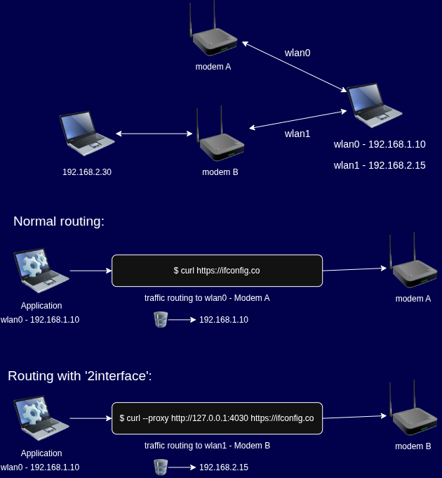

# 2interface

A Python-based Linux network manager for Wi-Fi discovery, connection management, policy-based routing, and per-application traffic routing.

<div align="center">



</div>

## Overview

**2interface** is a Linux networking utility designed for systems with multiple network interfaces. Its primary purpose is to route the traffic of selected applications through a specific Wi-Fi interface while keeping the rest of the system's network traffic unchanged.

The project is especially useful when a computer has an additional Wi-Fi adapter connected to a different network and an application needs to use that network specifically.

An additional benefit is access to devices and services on the network connected to the selected Wi-Fi interface. Once the interface is connected and its routing is configured, local network resources such as computers, servers, and other devices on that network can also become reachable. This capability does not require a separate connection mechanism; it is a natural result of the interface's network connectivity and routing.

## Key Features

- Discover nearby wireless networks.
- Connect a Wi-Fi interface to a specified SSID.
- Display the local IP address of a network interface.
- Determine the IPv4 default gateway of an interface.
- Scan for active devices on the interface's connected network.
- Determine the external IP address used by the connected wireless network.
- Start a proxy service for routing application traffic through a selected Wi-Fi interface.
- Support multi-interface Linux networking and policy-based routing.

## Usage

The available command-line options are listed below:

| Option | Description |
|---|---|
| `--scanwifi` | Lists the wireless networks detected by the network interface. |
| `--interface-address` | Displays the interface's local IP address. |
| `--interface-gateway` | Finds the IPv4 default gateway of the interface. |
| `--start-proxy` | Opens a proxy service to route the traffic of an application through the wireless network to which the interface is connected. |
| `--scan-interface` | Finds active devices by scanning the network connected through the interface. |
| `--interface-iplookup` | Obtains the external IP address of the wireless network to which the interface is connected. |
| `--connect-wifi` | Connects the selected wireless interface to a Wi-Fi network. |
| `--ssid SSID` | Specifies the SSID of the wireless network. |
| `--password PASSWORD` | Specifies the password of the wireless network. |

## Basic Concept

The general workflow is:

1. Detect the available Wi-Fi interfaces.
2. Select the interface that should be used for the secondary network.
3. Scan for available wireless networks.
4. Connect the interface to the desired Wi-Fi network.
5. Obtain interface and gateway information.
6. Optionally scan the connected network for active devices.
7. Start the proxy service when application-specific traffic routing is required.
8. Route the selected application's traffic through the secondary Wi-Fi connection.

This makes it possible to use two network paths on the same Linux system and selectively decide which traffic should use the secondary connection.

## Network Access

When the secondary Wi-Fi interface is connected to a network, devices and services reachable through that network may also become accessible from the host.

For example, if the secondary interface is connected to a network containing a local HTTP server, SSH server, NAS, or another computer, the host can communicate with those resources as long as normal network and firewall rules allow it.

This is an important secondary capability of 2interface: the project is not limited to forwarding Internet traffic. It can also provide practical access to resources available on the network attached to the secondary interface.

## Requirements

- Linux
- Python 3
- A Wi-Fi interface supported by the Linux system
- Appropriate permissions for network configuration and interface operations

Some operations may require elevated privileges depending on the Linux distribution and system configuration.

## Build .deb package
```bash
sudo apt install build-essential devscripts
dpkg-buildpackage -us -uc
```

## Project Status

2interface is an actively developed project focused on multi-interface networking, policy-based routing, and application-specific traffic routing on Linux.

## License

See the repository for the current license information.
